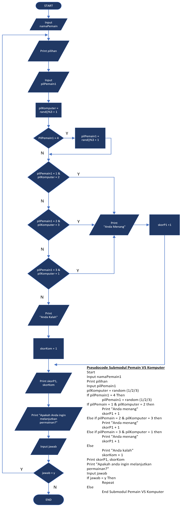

# DDP-GuntingKertas-Batu
Project membuat game gunting kertas batu dalam bahasa c++

## Pilihan Menu

Daftar Menu:
* Mulai Permainan
* Skor Saat Ini
* Reset Skor
* Keluar

## Pilihan Permainan

Daftar Mode Permainan:
* Pemain VS Komputer
* Pemain 1 VS Pemain 2
* Kembali ke Menu Utama

## Algoritma Deskriptif

1. Inisialisasi variabel skorP1, skorP2, dan skorKomputer menjadi 0.
2. Inisialisasi variabel p1, p2, ketP1, ketP2, dan ketK sebagai string kosong.
3. Tampilkan keterangan kelompok
4. Mulai perulangan utama:
   - Tampilkan pesan "Selamat Datang di Game Gunting Kertas Batu".
   - Tampilkan daftar menu:
      - "Mulai Bermain"
      - "Skor Saat Ini"
      - "Reset Skor"
      - "Keluar"
   - Meminta pengguna untuk memilih menu.
   - Jika menu adalah 1:
      - Memulai perulangan mode permainan:
         - "Pemain 1 vs Komputer"
         - "Pemain 1 vs Pemain 2"
         - "Kembali ke Menu Utama"
      - Meminta pengguna untuk memilih mode.
      - Jika mode adalah 1:
         - Memanggil fungsi vsKomputer().
      - Jika mode adalah 2:
         - Memanggil fungsi vsPemain().
      - Jika mode adalah 3, keluar dari perulangan mode.
   - Jika menu adalah 2:
      - Memanggil fungsi skorSaatIni().
   - Jika menu adalah 3:
      - Memanggil fungsi resetSkor().
   - Jika menu adalah 4, keluar dari program.
   - Jika menu tidak valid, tampilkan pesan error.

5. Fungsi vsKomputer():
   - Meminta nama pemain.
   - Memulai perulangan permainan:
      - Meminta pemain untuk memilih (Gunting, Kertas, Batu, atau Acak).
      - Komputer memilih secara acak (Gunting, Kertas, atau Batu).
      - Menampilkan hasil pilihan pemain dan komputer.
      - Memeriksa hasil dan memperbarui skor.
      - Menampilkan skor saat ini.
      - Meminta pengguna apakah ingin melanjutkan permainan.

6. Fungsi vsPemain():
   - Meminta nama pemain 1 dan nama pemain 2.
   - Memulai perulangan permainan:
      - Meminta pemain 1 untuk memilih (Gunting, Kertas, Batu, atau Acak).
      - Meminta pemain 2 untuk memilih (Gunting, Kertas, Batu, atau Acak).
      - Menampilkan hasil pilihan pemain 1 dan pemain 2.
      - Memeriksa hasil dan memperbarui skor.
      - Menampilkan skor saat ini.
      - Meminta pengguna apakah ingin melanjutkan permainan.

7. Fungsi skorSaatIni():
   - Menampilkan skor saat ini untuk pemain 1, pemain 2, dan komputer, diurutkan berdasarkan skor tertinggi.

8. Fungsi resetSkor():
   - Meminta konfirmasi untuk mereset skor.
   - Jika dikonfirmasi, mengatur skorP1, skorP2, dan skorKomputer menjadi 0.

9. Program selesai.

## Pseudocode
Pseudocode
1. Start
2. Print menu
3. Input menu
4. If menu = 1 then
      Submodul Mulai Permainan
5. Else if menu = 2 then
      Submodul Skor Saat Ini
6. Else if menu = 3 then
      Submodul Reset Skor
7. Else if menu = 4 then
      End
8. Else
      Print "Menu yang dipilih tidak valid"
9. Repeat

Pseudocode Submodul Mulai Permainan
1. Start
2. Print mode
3. Input mode
4. If mode = 1 then
      Submodul Pemain VS Komputer
5. Else if mode = 2 then
      Submodul Pemain 1 VS Pemain 2
6. Else if mode = 3 then
      End submodul
7. Else
      Print "Pilihan tidak valid"
8. Repeat

Pseudocode Submodul Pemain VS Komputer
1. Start
2. Input namaPemain1
3. Print pilihan
4. Input pilPemain1
5. pilKomputer = random (1/2/3)
6. If pilPemain1 = 4 Then
      pilPemain1 = random (1/2/3)
7. If pilPemain = 1 & pilKomputer = 2 then
      Print "Anda menang"
      skorP1 + 1
8. Else if pilPemain = 2 & pilKomputer = 3 then
      Print "Anda menang"
      skorP1 + 1
9. Else if pilPemain = 3 & pilKomputer = 1 then
      Print "Anda menang"
      skorP1 + 1
10. Else
      Print "Anda kalah"
      skorKom + 1
11. Print skorP1, skorKom
12. Print "Apakah anda ingin melanjutkan permainan?"
13. Input jawab
14. If jawab = y Then
      Repeat
15. Else
      End Submodul Pemain VS Komputer

Pseudocode Submodul Pemain 1 VS Pemain 2
1. Start
2. Input namaPemain1
3. Input namaPemain2
4. Print pilihan
5. Input pilPemain1
6. Input pilPemain2
7. If pilPemain1 = 4 Then
      pilPemain1 = random (1/2/3)
8. If pilPemain2 = 4 Then
      pilPemain2 = random (1/2/3)
9. If pilPemain1 = 1 & pilPemain1 = 2 Then
      Print "Pemain 1 menang"
      skorP1 + 1
10. Else if pilPemain1 = 2 & pilPemain2 = 3 Then
      Print "Pemain 1 menang"
      skorP1 + 1
11. Else if pilPemain1 = 3 & pilPemain2 = 1 Then
      Print "Pemain 1 menang"
      skorP1 + 1
12. Else
      Print "Pemain 2 menang"
      skorP2 + 1
13. Print skorP1, skorP2
14. Print "Apakah anda ingin melanjutkan permainan?"
15. If jawab = y Then
      Repeat
16. Else
      End Submodul Pemain1 VS Pemain 2

Pseudocode Submodul Skor Saat Ini
1. Start
2. Sort skor
3. Print skorP1, skorP2, skorKom
4. End Submodul

Pseudocode Submodul Reset Skor
1. Start
2. Print "Apakah anda yakin ingin mereset skor (y/n)"
3. Input pilihan
4. If pilihan = y Then
      Set skorP1=0, skorP2=0, skorKom=0
      Print "Skor Telah Direset"
5. Else
      Print "Skor Batal Direset"
6. End Submodul

## Flowchart

